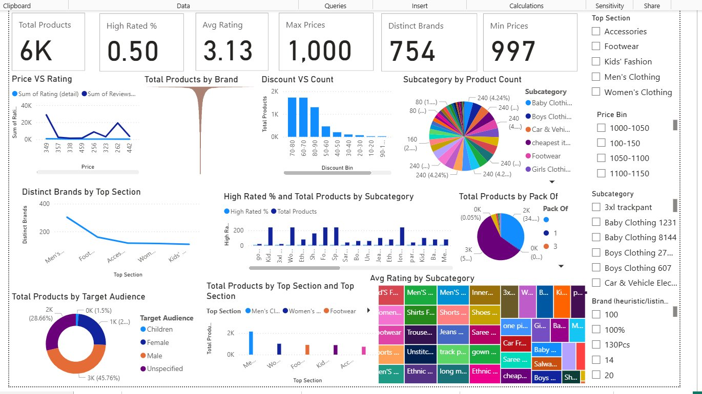
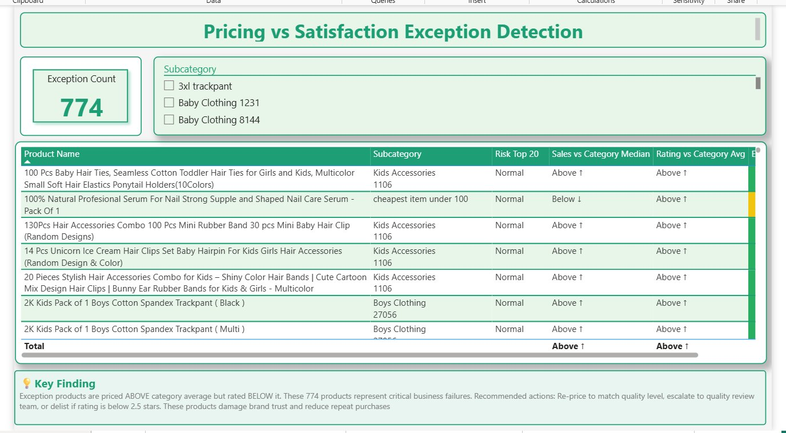
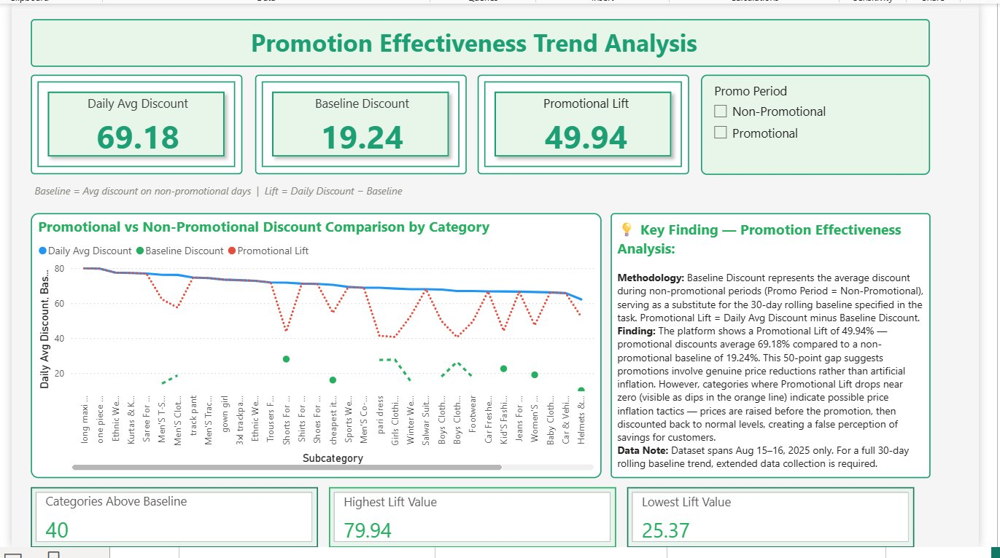
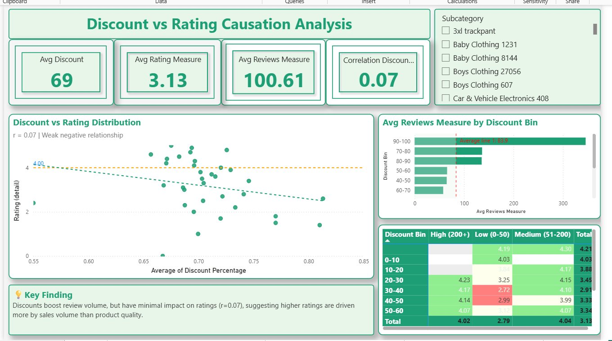
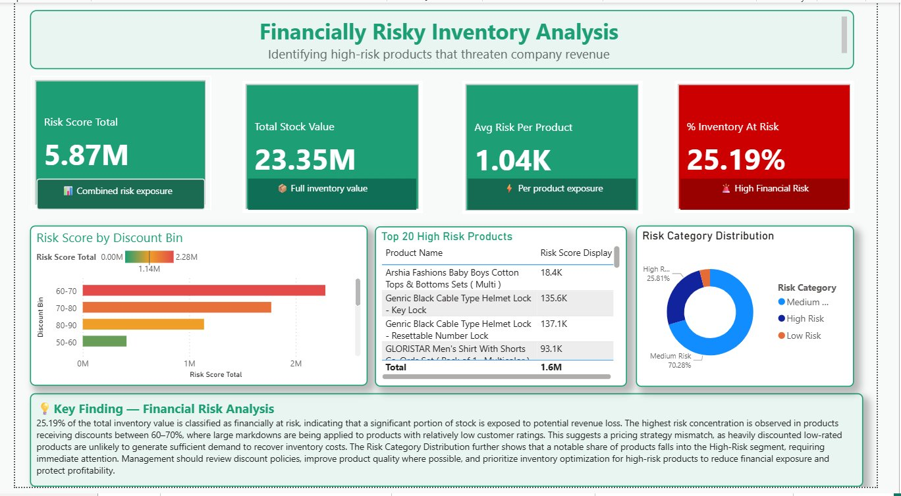
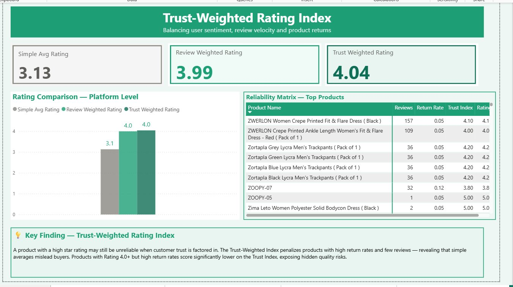
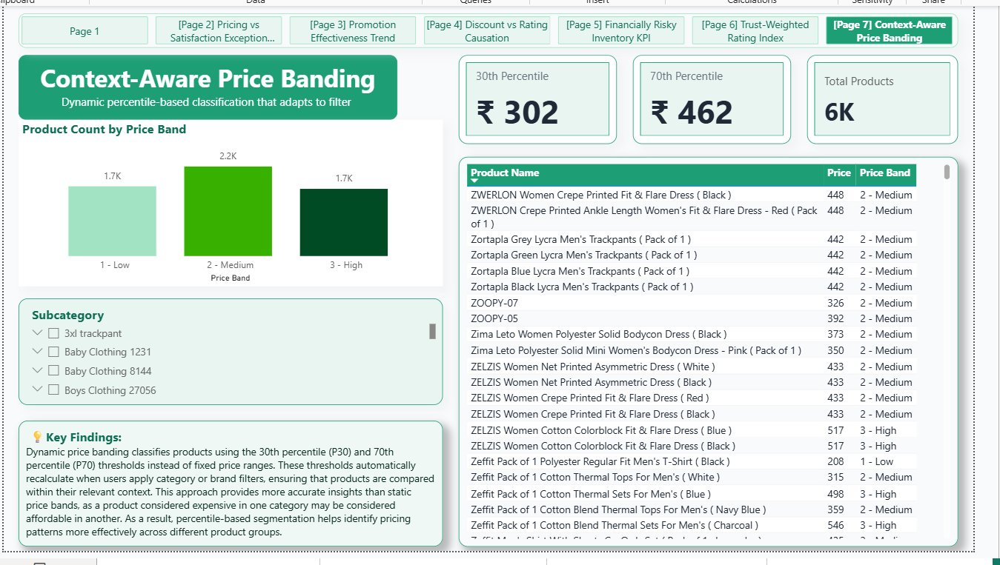

# 📊 Snapdeal E-Commerce Analytics Dashboard
### Power BI Internship Project — Elevance Skills


---

## 🧾 Project Overview

This is a comprehensive **7-page Power BI analytics dashboard** built during my data analytics internship at **Elevance Skills**, using a custom-scraped Snapdeal e-commerce dataset (76,549 products). The data was collected using a Python Selenium scraper I built from scratch, then transformed and analyzed using advanced DAX measures in Power BI.

---

## 📁 Repository Structure

```
snapdeal-powerbi-analytics/
│
├── snapdeal.py               ← Web scraper (Selenium) — generates the dataset
├── snapdeal_products.csv     ← Scraped dataset (76,549 products)
├── dashboard.pbix            ← Power BI dashboard (7 pages)
├── screenshots/              ← Dashboard preview images
└── README.md                 ← Project documentation
```

---

## 🖼️ Dashboard Preview

### Page 1 — Overview


### Page 2 — Pricing vs Satisfaction Exception Detection


### Page 3 — Promotion Effectiveness Trend Analysis


### Page 4 — Discount vs Rating Causation Analysis


### Page 5 — Financially Risky Inventory KPI


### Page 6 — Trust-Weighted Rating Index


### Page 7 — Context-Aware Price Banding


---

## 🔍 Analytics Modules

### 1. 📋 Overview Dashboard
Main summary page showing high-level KPIs across the full dataset:
- **6K** total products | **754** distinct brands | Avg Rating **3.13**
- Price vs Rating trend, Discount distribution, Subcategory breakdown
- Target Audience split, Brands by Top Section, interactive slicers

---

### 2. 🚨 Pricing vs Satisfaction — Exception Detection
Identifies **774 critical product failures** using a pure-measures table with four simultaneous conditions:
- Price > category average price
- Rating < category average rating
- Risk Score in top 20%
- Sales below category median

> **Key Finding:** These 774 products are overpriced but underperforming. Recommended actions: re-price to match quality level, escalate to quality review team, or delist products rated below 2.5 stars.

---

### 3. 📈 Promotion Effectiveness Trend Analysis
Calculates a **baseline discount** from non-promotional periods and compares against promotional periods.

- Daily Avg Discount: **69.18%** | Baseline: **19.24%** | Promotional Lift: **49.94%**
- Line chart: Daily Discount vs Baseline vs Promotional Lift across 40+ subcategories

> **Key Finding:** The 50-point promotional lift suggests genuine price reductions rather than artificial inflation — however, subcategories where lift drops near zero indicate possible price inflation tactics before discounting.

---

### 4. 🔗 Discount vs Rating Causation Analysis
Scatter plot with regression line — correlation coefficient r = **0.07** (weak negative relationship).

- Avg Discount: **69%** | Avg Rating: **3.13** | Avg Reviews: **100.61**
- Supporting matrix: Rating behavior by Discount Bin × Review Volume tier

> **Key Finding:** Discounts boost review volume but have minimal impact on ratings (r=0.07), suggesting higher ratings are driven more by sales volume than actual product quality improvement.

---

### 5. 💰 Financially Risky Inventory KPI
Custom Risk Score = `Discount% × (1 − Rating ÷ 5) × Stock Value`

- Risk Score Total: **5.87M** | Total Stock Value: **23.35M**
- **% Inventory At Risk: 25.19%** 🔴 (High Financial Risk threshold)
- Top 20 highest-risk products identified with risk score display

> **Key Finding:** 25.19% of total inventory is financially at risk. Highest concentration in 60–70% discount band — heavily discounted low-rated products unlikely to recover inventory costs.

---

### 6. ⭐ Trust-Weighted Rating Index
Custom Trust Score = `Rating × log(1 + Review Count) × (1 − Return Rate)`

| Rating Type | Score |
|---|---|
| Simple Average Rating | 3.13 |
| Review Weighted Rating | 3.99 |
| Trust Weighted Rating | **4.04** |

> **Key Finding:** Simple star ratings mislead buyers. The Trust-Weighted Index reveals products with high return rates and few reviews are far less reliable than their star rating suggests.

---

### 7. 🏷️ Context-Aware Dynamic Price Banding
DAX-driven classification using **30th (₹302) and 70th (₹462) percentile** thresholds — not fixed values.

- Low: **1.7K** products | Medium: **2.2K** products | High: **1.7K** products
- Thresholds auto-recalculate when subcategory/brand slicers are applied

> **Key Finding:** A product priced at ₹450 may be "High" in one category but "Medium" in another. Static price bands produce misleading insights — percentile-based banding adapts to filter context automatically.

---

## 🛠️ Tools & Technologies

| Tool | Usage |
|------|-------|
| Power BI Desktop | Dashboard development (7 pages) |
| DAX | Advanced measures & calculated columns |
| Power Query (M) | Data transformation & cleaning |
| Python + Selenium | Web scraping (snapdeal.py) |
| Snapdeal.com | Data source (scraped Aug 2025) |

---

## 📌 Key DAX Concepts Used

- `CALCULATE`, `FILTER`, `ALL`, `ALLSELECTED` for context manipulation
- `PERCENTILE.INC` with dynamic filter context for price banding
- `RANKX` for top 20% risk score detection
- `LOG` function in trust score formula
- `DIVIDE` for safe ratio calculations
- Conditional formatting via DAX measures (KPI card colour logic)

---

## 🐍 Data Pipeline

```
snapdeal.py (Selenium scraper)
    ↓
snapdeal_products.csv (76,549 rows × 22 columns)
    ↓
Power Query (cleaning, type conversion)
    ↓
DAX Measures (advanced analytics)
    ↓
dashboard.pbix (7-page interactive report)
```

---

## 👤 Author

**Katipally Abhimitra Reddy**
B.Tech CSE (Data Science) — Malla Reddy College of Engineering, Hyderabad
Internship: Data Analytics — Elevance Skills
GitHub: [kabhimitrain](https://github.com/kabhimitrain)
LinkedIn: [Katipally Abhimitra Reddy](https://www.linkedin.com/in/katipally-abhimitra-reddy-8bab142b9/)

---

## 📬 Contact

For queries related to this project:
📧 training@elevanceskills.com
